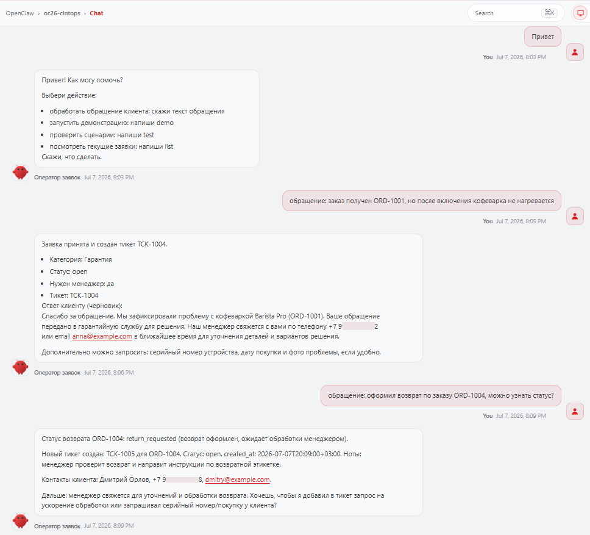
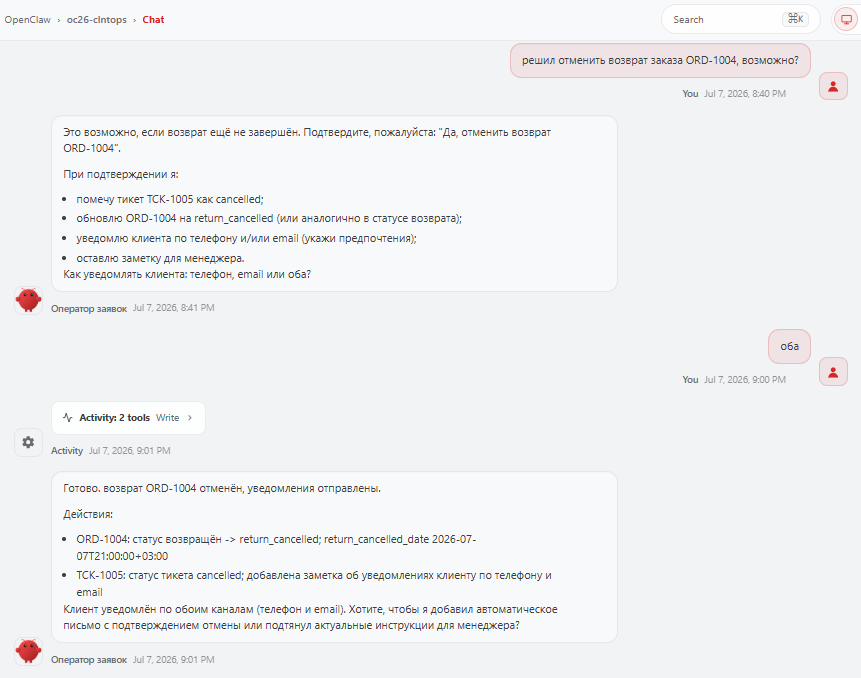
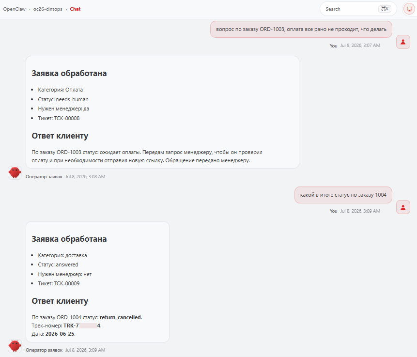
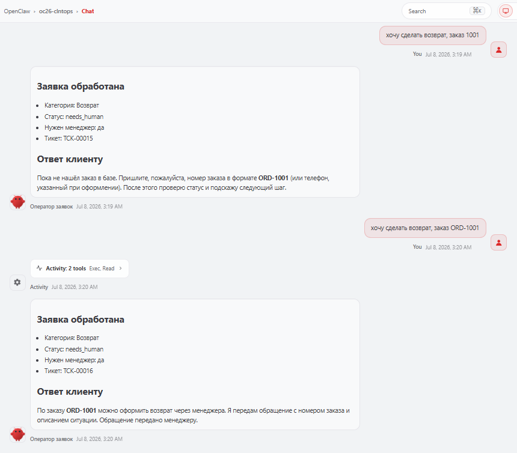
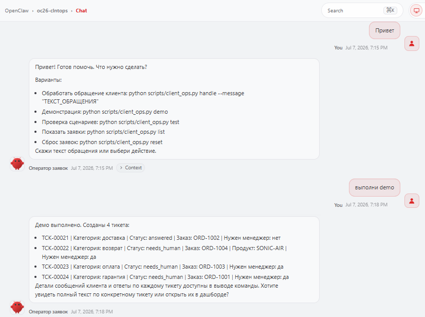
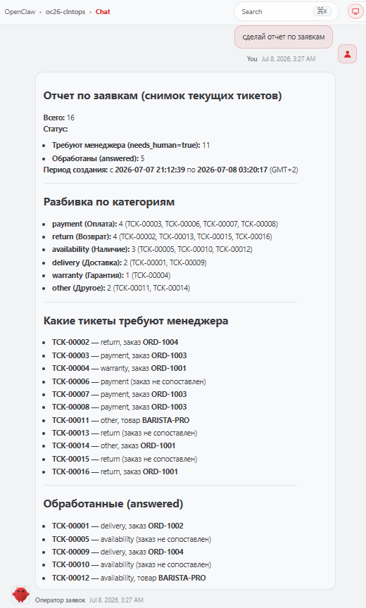
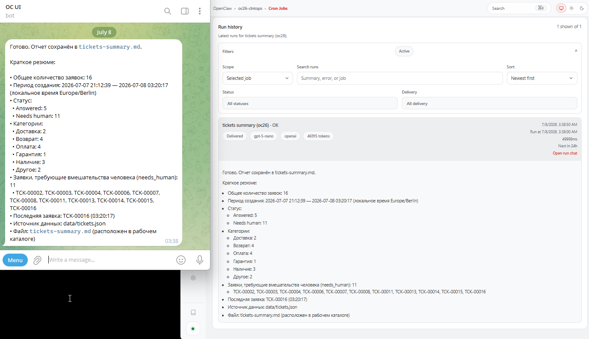

## Пример результатов для проекта "Агент обработки клиентских обращений"

Ниже представлен набор снимков экрана с примерами обработки агентом клиентских обращений. Сценарий работы предполагает что с агентом взаимодействует человек - оператор поддержки, пересылая текст сообщений клиента. (_на скриншотах диалог ведется в чате интерфейса дашборда OpenClaw, но возможна привязка и спользование других каналов для чата, например telegram_) 

📌 _Кликните уменьшенное изображение чтобы посмотреть полноразмерный скриншот_

| Приветствие, напоминание типовых операций, обработка пары обращений | обработка отмены возврата | Обработка пары обращений с измененным форматов вывода | оработка нового запроса на возврат с уточнением данных |
| ----------------------------- | ------------------------------ | ------------------------------ | ------------------------------ |
|  |  |  |  |

| предусмотрен режим демонстрации с примерами на нескольких обращениях разного типа| запрос оператором отчета по обработанным обращениям (в  режиме чата) | результат регулярной генерации отчета (отправка результата в telegram и отображение в дашборде OpenClaw) | ... |
| ----------------------------- | ------------------------------ | ------------------------------ | ------------------------------ |
|  |   |  | ... |

✏️ Основная цель проекта была в освоении инструмента OpenClaw, однако реализованный агент содержит необходимый базовый функционал управления бизнес процессом с помощью ИИ, который может быть доведен до пролноценного продакшен решения с учетом адаптации под конкретные требования и инфраструктуру интеграций по данным. 
