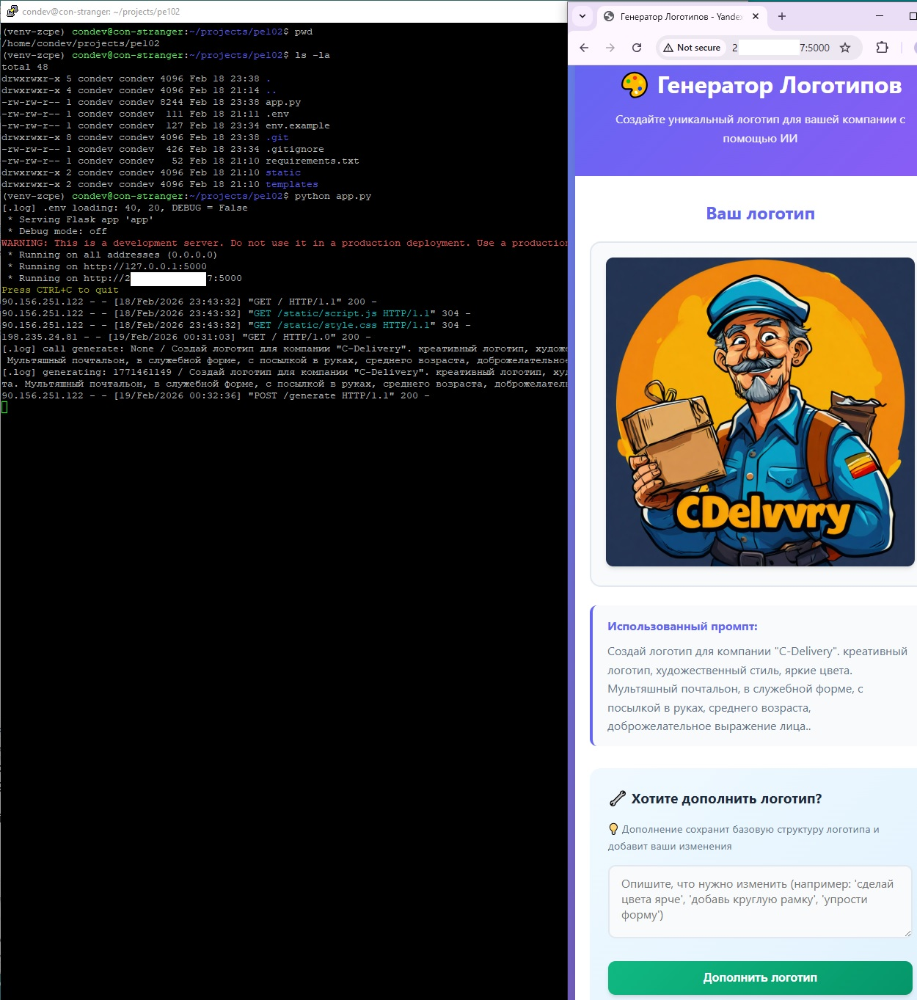
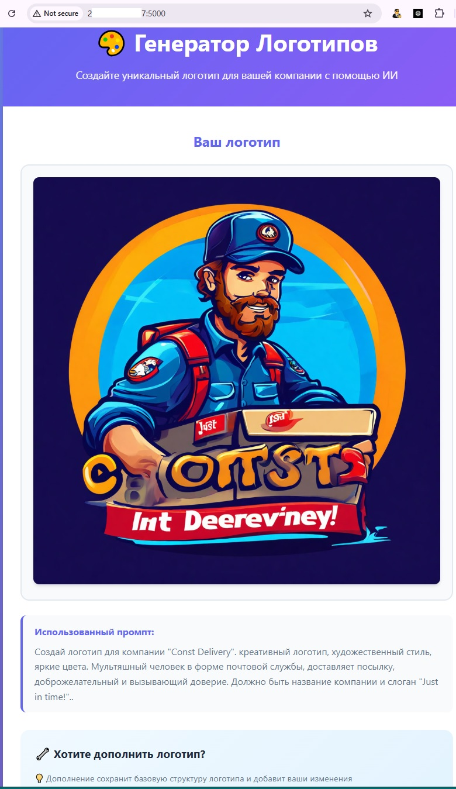
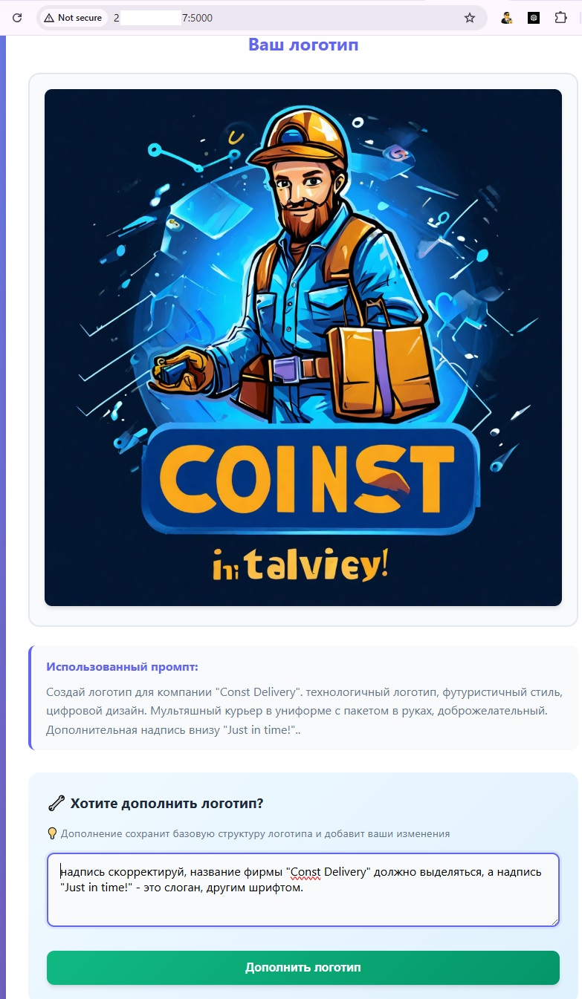
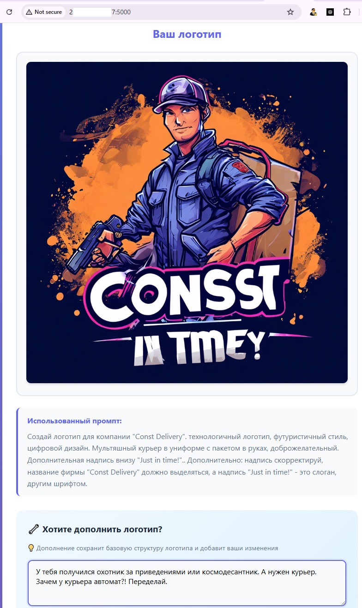

## Пример результатов для проекта "Генератор логотипов"

Ниже представлен набор снимков экрана сайта, управляющего генерацией логотипов, с результатами генерации и соотвествующими промптами для генерации или корректировки: 

📌 _Кникните уменьшенное изображение чтобы посмотреть полноразмерный скриншот_

| Консоль VPS сервера, где запущен сайт и сайт в браузере | Одна из попыток генерации | Генерациия с попыткой корректировки | Корректировка |
| ----------------------------- | ------------------------------ | ------------------------------ | ------------------------------ |
|  |  |  |  |

✏️ Основная цель проекта была в освоении инструмента, но замечу, что результаты использования этой модели в таком режиме получались не особо удачными, особенно при попытках корректировки. imho, для цели генерирования логитипов (с возможностью корректировками по результату) понадобится поэкспериментировать с промптами или параметрами для этой модели или поискать другую. 
